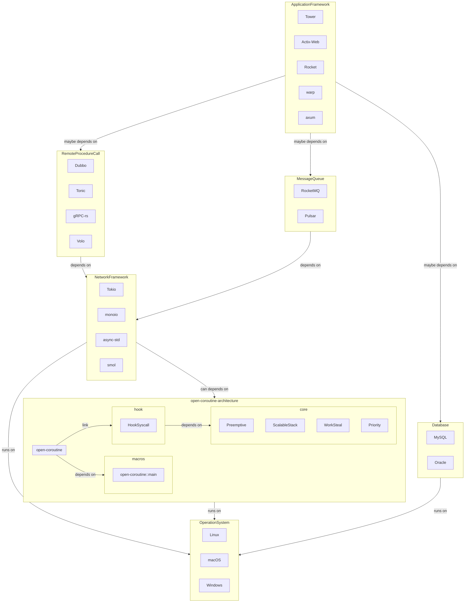

# open-coroutine

[](https://crates.io/crates/open-coroutine)
[](https://docs.rs/open-coroutine)
[](https://github.com/acl-dev/open-coroutine/blob/master/LICENSE-APACHE)
[](https://github.com/acl-dev/open-coroutine/actions)
[](https://codecov.io/github/acl-dev/open-coroutine)
[](http://isitmaintained.com/project/acl-dev/open-coroutine "Average time to resolve an issue")
[](http://isitmaintained.com/project/acl-dev/open-coroutine "Percentage of issues still open")

The `open-coroutine` is a simple, efficient and generic stackfull-coroutine library, you can use this as a performance
replacement for IO thread pools, see [why better](core/docs/en/why-better.md).

English | [中文](README_ZH.md)

## 🚀 Features

- [x] Preemptive(`not supported in windows`): even if the coroutine enters a dead loop, it can still be seized,
  see [example](https://github.com/loongs-zhang/open-coroutine/blob/master/open-coroutine/examples/preemptive.rs);
- [x] Hook: you are free to use most of the slow syscall in coroutine, see supported syscall
  on [unix](https://github.com/acl-dev/open-coroutine/blob/master/hook/src/syscall/unix.rs)/[windows](https://github.com/acl-dev/open-coroutine/blob/master/hook/src/syscall/windows.rs);
- [x] Scalable: the size of the coroutine stack supports unlimited expansion without the cost of copying stack, and
  immediately shrinks to the original size after use,
  see [example](https://github.com/loongs-zhang/open-coroutine/blob/master/open-coroutine/examples/scalable_stack.rs);
- [x] io_uring(`only in linux`): supports and is compatible with io_uring in terms of local file IO and network IO. If
  it's not supported on your system, it will fall back to non-blocking IO;
- [x] Priority: support custom task priority, note that coroutine priority is not open to users;
- [x] Work Steal: internally using a lock free work steal queue;
- [x] Compatibility: the implementation of open-coroutine is no async, but it is compatible with async, which means you
  can use this crate in `tokio/async-std/smol/...`;
- [x] Platforms: running on Linux, macOS and Windows;

## 🕊 Roadmap

- [ ] add
  performance [benchmark](https://github.com/TechEmpower/FrameworkBenchmarks/wiki/Project-Information-Framework-Tests-Overview);
- [ ] cancel coroutine/task;
- [ ] add metrics;
- [ ] add synchronization toolkit;
- [ ] support and compatibility for AF_XDP socket;

## 🏠 Architecture



## 📖 Quick Start

### step1: add dependency to your Cargo.toml

```toml
[dependencies]
# check https://crates.io/crates/open-coroutine
open-coroutine = "x.y.z"
```

### step2: add `open_coroutine::main` macro

```rust
#[open_coroutine::main]
fn main() {
    //......
}
```

### step3: create a task

```rust
#[open_coroutine::main]
fn main() {
    _ = open_coroutine::task!(|param| {
        assert_eq!(param, "param");
    }, "param");
}
```

## 🪶 Advanced Usage

### create a task with priority

```rust
#[open_coroutine::main]
fn main() {
    _ = open_coroutine::task!(|param| {
        assert_eq!(param, "param");
    }, "param", 1/*the smaller the value, the higher the priority*/);
}
```

### wait until the task is completed or timed out

```rust
#[open_coroutine::main]
fn main() {
    let task = open_coroutine::task!(|param| {
        assert_eq!(param, "param");
    }, "param", 1);
    task.timeout_join(std::time::Duration::from_secs(1)).expect("timeout");
}
```

### scalable stack

```rust
#[open_coroutine::main]
fn main() {
    _ = open_coroutine::task!(|_| {
        fn recurse(i: u32, p: &mut [u8; 10240]) {
            open_coroutine::maybe_grow!(|| {
                // Ensure the stack allocation isn't optimized away.
                unsafe { _ = std::ptr::read_volatile(&p) };
                if i > 0 {
                    recurse(i - 1, &mut [0; 10240]);
                }
            })
            .expect("allocate stack failed")
        }
        println!("[task] launched");
        // Use ~500KB of stack.
        recurse(50, &mut [0; 10240]);
    }, ());
}
```

## ⚓ Learn More

- [Project Overview](core/docs/en/overview.md)
- [Background](docs/en/background.md)
- [Why Rust](docs/en/why-rust.md)
- [Coroutine Overview](core/docs/en/coroutine.md)
- [Scalable Stack Overview](core/docs/en/scalable-stack.md)
- [Monitor Overview](core/docs/en/monitor.md)
- [Work Steal Overview](core/docs/en/work-steal.md)
- [Ordered Work Steal Overview](core/docs/en/ordered-work-steal.md)
- [Coroutine Pool Overview](core/docs/en/coroutine-pool.md)
- [Hook Overview](hook/docs/en/hook.md)

[Old Docs Here](https://github.com/acl-dev/open-coroutine-docs)

## 👍 Credits

This crate was inspired by the following projects:

- [acl](https://github.com/acl-dev/acl)
- [coost](https://github.com/idealvin/coost)
- [golang](https://github.com/golang/go)
- [stacker](https://github.com/rust-lang/stacker)
- [monoio](https://github.com/bytedance/monoio)
- [compio](https://github.com/compio-rs/compio)
- [may](https://github.com/Xudong-Huang/may)

Thanks to those who have provided assistance:

[](https://github.com/Amanieu)
[](https://github.com/bjorn3)
[](https://github.com/workingjubilee)
[](https://github.com/Noratrieb)
