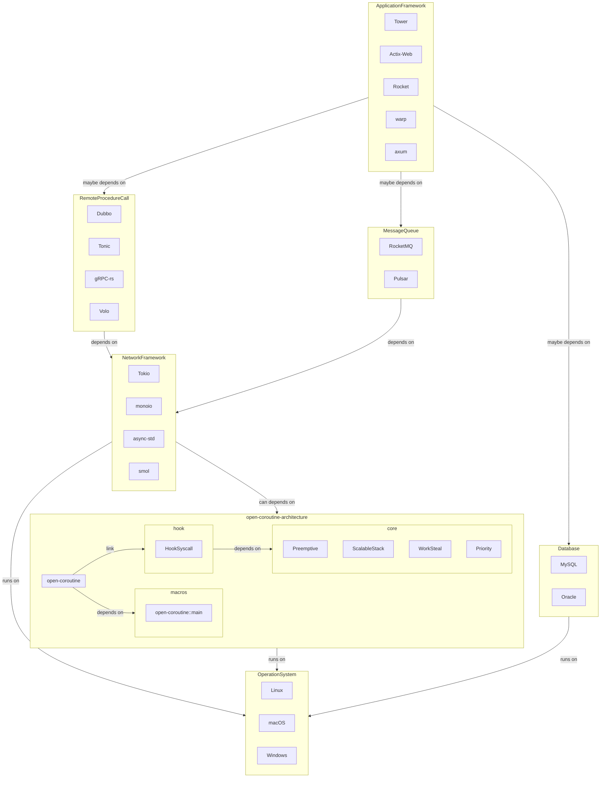

# open-coroutine

[](https://crates.io/crates/open-coroutine)
[](https://docs.rs/open-coroutine)
[](https://github.com/acl-dev/open-coroutine/blob/master/LICENSE-APACHE)
[](https://github.com/acl-dev/open-coroutine/actions)
[](https://codecov.io/github/acl-dev/open-coroutine)
[](http://isitmaintained.com/project/acl-dev/open-coroutine "解决issue的平均时间")
[](http://isitmaintained.com/project/acl-dev/open-coroutine "仍未关闭issue的百分比")

`open-coroutine`是一个简单、高效、通用的有栈协程库，您可以将其用作IO线程池的性能替代，查看[为什么更好](core/docs/en/why-better.md).

[English](README.md) | 中文

## 🚀 当前特性

- [x] 抢占调度(`不支持windows`):
  即使协程进入死循环，它仍能被抢占，查看[例子](https://github.com/loongs-zhang/open-coroutine/blob/master/open-coroutine/examples/preemptive.rs);
- [x] Hook:
  您可以在协程中自由使用大多数慢系统调用，查看支持的系统调用[unix](https://github.com/acl-dev/open-coroutine/blob/master/hook/src/syscall/unix.rs)/[windows](https://github.com/acl-dev/open-coroutine/blob/master/hook/src/syscall/windows.rs);
- [x] 可伸缩栈:
  协程栈的大小支持无限制扩容而没有复制堆栈的开销，查看[例子](https://github.com/loongs-zhang/open-coroutine/blob/master/open-coroutine/examples/scalable_stack.rs);
- [x] io_uring(`只支持linux`): 在本地文件IO和网络IO方面支持并兼容io_uring。如果您的系统不支持，它将回退到NIO;
- [x] 优先级: 支持自定义任务优先级，注意协程优先级未对用户开放;
- [x] 任务窃取: 内部使用无锁任务窃取队列;
- [x] 兼容性: open-coroutine的实现是No async的，但它与async兼容，这意味着您可以在`tokio/sync-std/smol/...`中使用这个crate;
- [x] 跨平台: 支持Linux、macOS和Windows;

## 🕊 未来计划

- [ ] 
  增加性能[基准测试](https://github.com/TechEmpower/FrameworkBenchmarks/wiki/Project-Information-Framework-Tests-Overview);
- [ ] 取消协程/任务;
- [ ] 增加性能指标;
- [ ] 增加并发工具包;
- [ ] 支持AF_XDP套接字;

## 🏠 架构设计



## 📖 快速接入

### step1: 在你的Cargo.toml中添加依赖

```toml
[dependencies]
# check https://crates.io/crates/open-coroutine
open-coroutine = "x.y.z"
```

### step2: 添加`open_coroutine::main`宏

```rust
#[open_coroutine::main]
fn main() {
    //......
}
```

### step3: 创建任务

```rust
#[open_coroutine::main]
fn main() {
    _ = open_coroutine::task!(|param| {
        assert_eq!(param, "param");
    }, "param");
}
```

## 🪶 进阶使用

### 创建具有优先级的任务

```rust
#[open_coroutine::main]
fn main() {
    _ = open_coroutine::task!(|param| {
        assert_eq!(param, "param");
    }, "param", 1/*数值越小，优先级越高*/);
}
```

### 等待任务完成或超时

```rust
#[open_coroutine::main]
fn main() {
    let task = open_coroutine::task!(|param| {
        assert_eq!(param, "param");
    }, "param", 1);
    task.timeout_join(std::time::Duration::from_secs(1)).expect("timeout");
}
```

### 可伸缩栈

```rust
#[open_coroutine::main]
fn main() {
    _ = open_coroutine::task!(|_| {
        fn recurse(i: u32, p: &mut [u8; 10240]) {
            open_coroutine::maybe_grow!(|| {
                // Ensure the stack allocation isn't optimized away.
                unsafe { _ = std::ptr::read_volatile(&p) };
                if i > 0 {
                    recurse(i - 1, &mut [0; 10240]);
                }
            })
            .expect("allocate stack failed")
        }
        println!("[task] launched");
        // Use ~500KB of stack.
        recurse(50, &mut [0; 10240]);
    }, ());
}
```

## ⚓ 了解更多

- [诞生之因](docs/cn/background.md)
- [语言选择](docs/cn/why-rust.md)

[旧版文档在这](https://github.com/acl-dev/open-coroutine-docs)

## 👍 鸣谢

这个crate的灵感来自以下项目：

- [acl](https://github.com/acl-dev/acl)
- [coost](https://github.com/idealvin/coost)
- [golang](https://github.com/golang/go)
- [stacker](https://github.com/rust-lang/stacker)
- [monoio](https://github.com/bytedance/monoio)
- [compio](https://github.com/compio-rs/compio)
- [may](https://github.com/Xudong-Huang/may)

感谢那些提供帮助的人：

[](https://github.com/Amanieu)
[](https://github.com/bjorn3)
[](https://github.com/workingjubilee)
[](https://github.com/Noratrieb)
