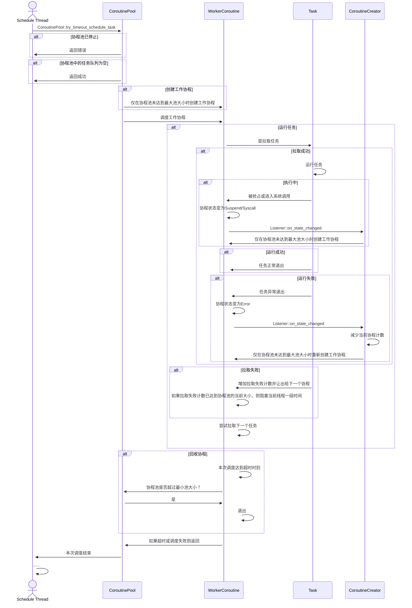

# 协程池总览

[English](../en/coroutine-pool.md) | 中文

## 使用方法

```rust
use open_coroutine_core::co_pool::CoroutinePool;

fn main() -> std::io::Result<()> {
    let mut pool = CoroutinePool::default();
    assert!(pool.is_empty());
    pool.submit_task(
        None,
        |_| {
            println!("Hello, world!");
            Some(2)
        },
        None,
        None,
    )?;
    assert!(!pool.is_empty());
    pool.try_schedule_task()
}
```

## 为什么需要协程池？

使用协程池可以带来以下几个显著的优势：

1. 资源管理：协程池可以管理协程的创建、销毁和复用。通过使用协程池，可以预先创建一定数量的协程并存储在池中，以便在需要时使用。这样可以避免频繁创建和销毁协程，减少不必要的资源浪费，并提高系统性能。

2. 避免协程饥饿：在使用协程池时，协程会持续获得任务，避免了协程在完成任务后空闲的情况。

3. 并发控制：通过设置协程池的参数，可以限制并发协程的数量，避免因协程过多而导致系统过载。

4. 提高代码可维护性：使用协程池可以将任务执行与协程管理分离，使代码更加清晰和易于维护。任务的执行逻辑可以专注于任务本身，而协程的创建和管理则由协程池处理。

## 工作原理

在open-coroutine-core中，协程池是惰性的，这意味着如果你不调用`CoroutinePool::try_timeout_schedule_task`，任务将不会被执行。详情请参考以下时序图：


