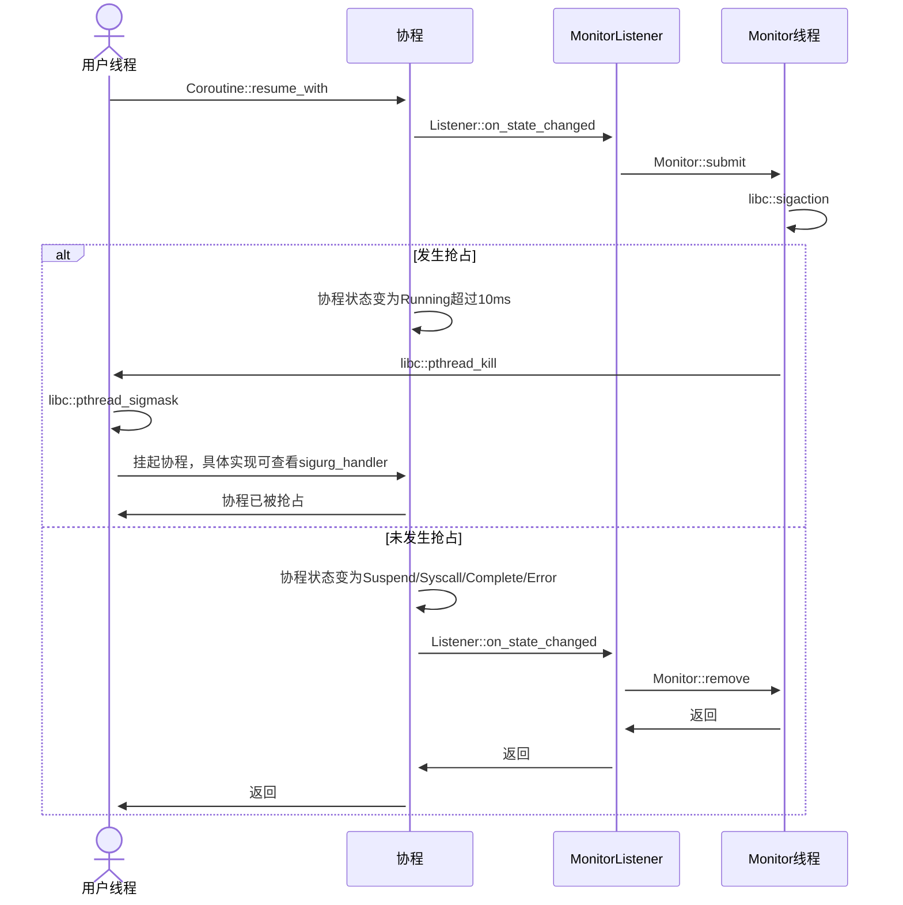

# Monitor总览

[English](../en/monitor.md) | 中文

## 支持范围

`preemptive`特性目前支持以下targets：

|               | ELF (Linux, BSD, bare metal, etc) | Darwin (macOS, iOS, etc) | Windows |
|---------------|-----------------------------------|--------------------------|---------|
| `x86_64`      | ✅                                | ✅                       | ❌     |
| `x86`         | ✅                                | ❌                       | ❌     |
| `AArch64`     | ✅                                | ✅                       | ❌     |
| `ARM`         | ✅                                | ❌                       | ❌     |
| `RISC-V`      | ✅                                | ❌                       | ❌     |
| `LoongArch64` | ✅                                | ❌                       | ❌     |

✅ 已测试且稳定；⚠️ 已测试但不稳定；❌ 不支持。

⚠️ 如果你想直接在`open-coroutine-core`中使用`preemptive`特性，你必须学习[Hook总览](../../../hook/docs/cn/hook.md)。

## 使用方法

```rust
use open_coroutine_core::co;
use open_coroutine_core::common::constants::CoroutineState;
use open_coroutine_core::coroutine::Coroutine;

fn main() -> std::io::Result<()> {
    // 模拟最极端的死循环，如果未启用preemptive特性，协程恢复后将一直卡在死循环中
    let mut coroutine: Coroutine<(), (), ()> = co!(|_, ()| { loop {} })?;
    assert_eq!(CoroutineState::Suspend((), 0), coroutine.resume()?);
    // 如果未启用抢占特性，将永远不会到达此处
    assert_eq!(CoroutineState::Suspend((), 0), coroutine.state());
    Ok(())
}
```

## 为什么需要抢占？

在调用`Coroutine::resume_with`后，协程可能会长时间占用调度线程，从而拖慢由该调度线程调度的其他协程。协程在两种情况下会长时间占用调度线程：陷入重度计算或系统调用。为了解决陷入重度计算的问题，我们引入抢占式调度，它会自动挂起长时间执行的协程，并允许其他协程执行。

## 什么是monitor？

`monitor`是open-coroutine-core的一个模块，它实现了`preemptive`特性，这允许协程在长时间运行后被抢占。

## 工作原理


