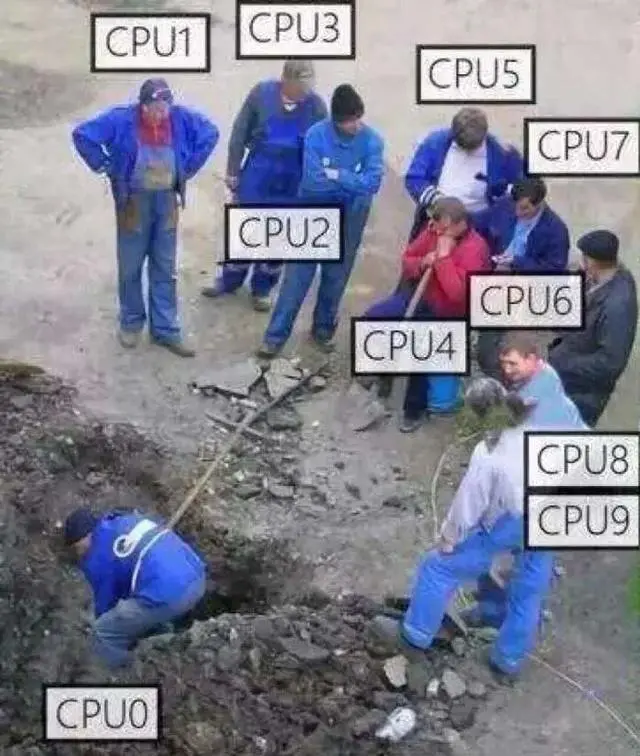

# 有序工作窃取总览

[English](../en/ordered-work-steal.md) | 中文

## 为什么需要有序工作窃取？

在现实世界中，总是有一些线程先完成自己的任务，而其他线程还有任务需要处理。于是，就会出现一核有难、多核围观的壮观场景。

    

显然，我们不希望这种情况发生。对于空闲的线程，与其让它们围观其他线程工作，不如让它们帮助其他线程工作。此外，我们希望根据优先级执行任务，优先级越高，任务越早被执行。

## 什么是有序工作窃取队列？

有序工作窃取队列由一个全局队列和多个本地队列组成，全局队列是无界的，而本地队列是一个有界的`SkipList`集合。为了确保高性能，本地队列的数量通常等于线程的数量。值得一提的是，如果所有线程都优先处理本地任务，可能会出现一种极端情况，即共享队列上的任务永远没有机会被调度。为了避免这种不平衡，参考goroutine的设计，每次线程从本地队列调度了60个任务后，强制从共享队列中弹出`优先级最高的任务`。

## `push`的工作原理

## `pop`的工作原理

