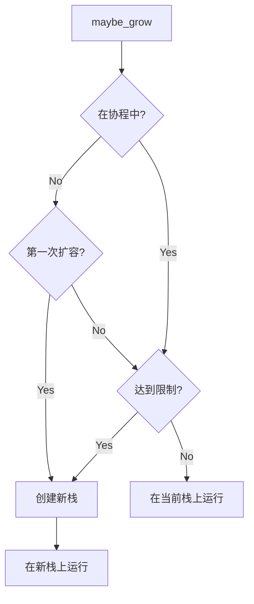

# 可伸缩栈总览

[English](../en/scalable-stack.md) | 中文

## 使用方法

```rust
use open_coroutine_core::co;
use open_coroutine_core::common::constants::CoroutineState;
use open_coroutine_core::coroutine::suspender::Suspender;
use open_coroutine_core::coroutine::Coroutine;

fn main() -> std::io::Result<()> {
    let mut co = co!(|_: &Suspender<(), i32>, ()| {
        fn recurse(i: u32, p: &mut [u8; 10240]) {
            // 你也可以在线程中使用`maybe_grow`
            Coroutine::<(), i32, ()>::maybe_grow(|| {
                // 确保栈分配不会被优化掉
                unsafe { std::ptr::read_volatile(&p) };
                if i > 0 {
                    recurse(i - 1, &mut [0; 10240]);
                }
            })
            .expect("allocate stack failed")
        }
        // 使用约500KB的栈
        recurse(50, &mut [0; 10240]);
    })?;
    assert_eq!(co.resume()?, CoroutineState::Complete(()));
    Ok(())
}
```

## 为什么需要可伸缩栈？

协程的默认栈大小为128KB，这对于大多数场景来说已经足够，但仍有一些场景不适用，例如递归算法。可扩展栈允许在程序中标注可能需要更大栈的扩容点。如果栈达到其限制，则会溢出到堆中。

## 工作原理


