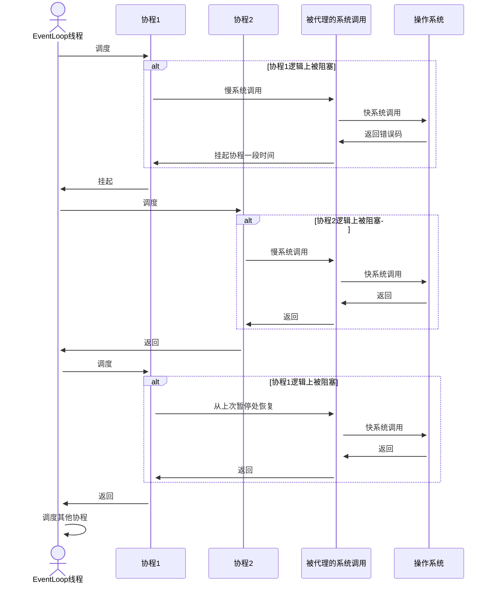

# 为什么更好

[English](../en/why-better.md) | 中文

## 系统调用不会阻塞

首先，我们来看一下线程是如何与系统调用协作的。

如果系统调用是一个慢系统调用，例如默认阻塞的`accept`，线程将被长时间阻塞，直到操作系统返回为止，期间无法做任何事情。现在，我们来看一下 open-coroutine 是如何与系统调用协作的。

如你所见，`被代理的系统调用`(hook)将`慢系统调用`转换为`快系统调用`。通过这种方式，尽管`EventLoop线程`在执行系统调用时仍然会被阻塞，但阻塞时间非常短。因此，与线程模型相比，`EventLoop线程`可以在相同的时间内做更多的事情。

## 重度计算不会阻塞

其次，我们来看一下线程如何处理重度计算。

就像上面的系统调用一样，线程会一直阻塞在循环中。接下来，我们来看一下open-coroutine如何处理重度计算。

`Monitor`会监控协程的执行情况，一旦发现某个协程的执行时间过长，就会强制挂起该协程。因此，现在我们甚至可以[使用一个`EventLoop线程`来执行多个循环](https://github.com/loongs-zhang/open-coroutine/blob/master/open-coroutine/examples/preemptive.rs)，这是单线程模型无法实现的。
