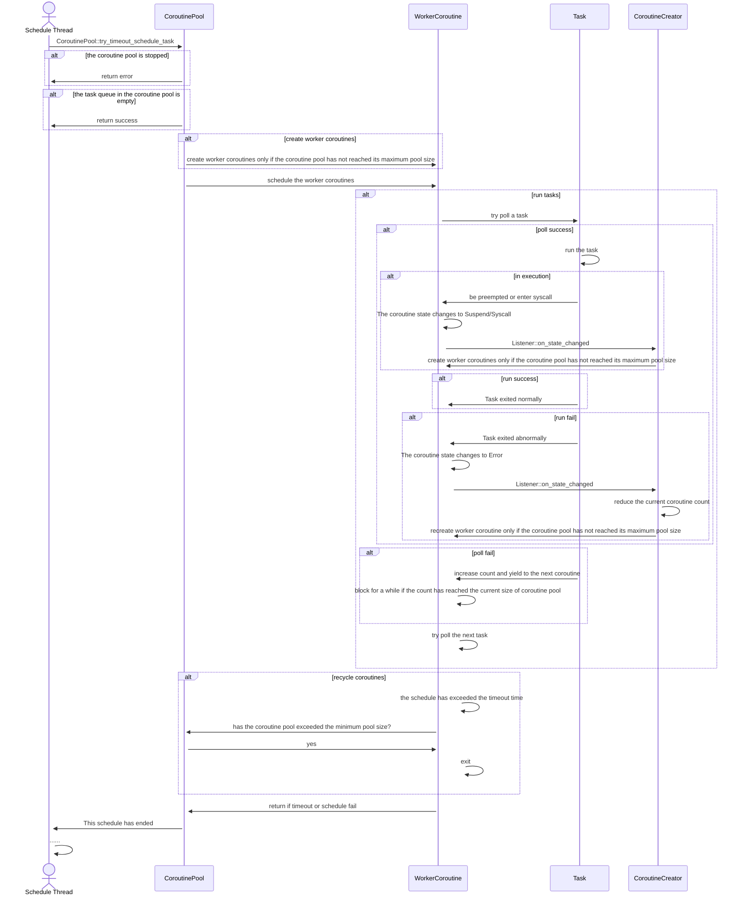

# Coroutine Pool Overview

## Usage

```rust
use open_coroutine_core::co_pool::CoroutinePool;

fn main() -> std::io::Result<()> {
    let mut pool = CoroutinePool::default();
    assert!(pool.is_empty());
    pool.submit_task(
        Some(String::from(task_name)),
        |_| {
            println!("Hello, world!");
            Some(2)
        },
        None,
        None,
    )?;
    assert!(!pool.is_empty());
    pool.try_schedule_task()
}
```

## Why coroutine pool?

Pooling the coroutines can bring several significant advantages:

1. Resource management: The coroutine pool can manage the creation, destruction, and reuse of coroutines. By using a
   coroutine pool, a certain number of coroutines can be created in advance and stored in the pool for use when needed.
   This can avoid frequent creation and destruction of coroutines, reduce unnecessary resource waste, and improve system
   performance.

2. Avoid coroutine hunger: When using a coroutine pool, coroutines will be continuously provided with tasks, avoiding
   the situation where coroutines are idle after completing tasks.

3. Concurrency control: By setting the parameters of the coroutine pool, the number of concurrent coroutines can be
   limited to avoid overloading the system due to too many coroutines.

4. Improve code maintainability: Using coroutine pools can separate task execution from coroutine management, making the
   code clearer and more maintainable. The execution logic of a task can be focused on the task itself, while the
   creation and management of coroutines are handled by the coroutine pool.

## How it works

In open-coroutine-core, the coroutine pool is lazy, which means if you don't call `try_timeout_schedule_task`, tasks
will not be executed. Please refer to the sequence diagram below for details:


