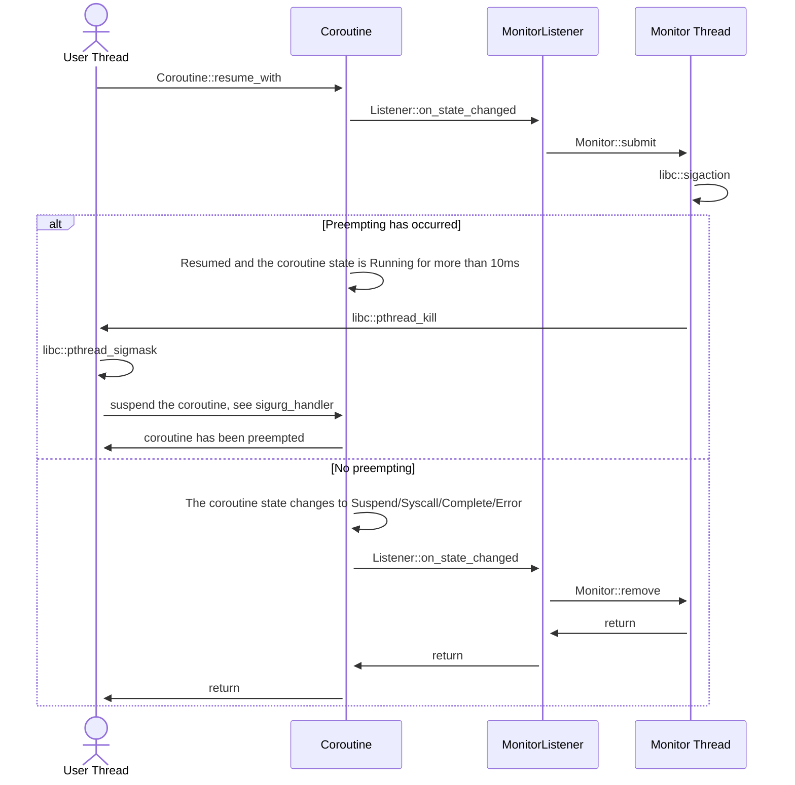

# Monitor Overview

## Supported Targets

The `preemptive` feature currently supports the following targets:

|               | ELF (Linux, BSD, bare metal, etc) | Darwin (macOS, iOS, etc) | Windows |
|---------------|-----------------------------------|--------------------------|---------|
| `x86_64`      | ✅                                | ✅                       | ❌     |
| `x86`         | ✅                                | ❌                       | ❌     |
| `AArch64`     | ⚠️                                | ✅                       | ❌     |
| `ARM`         | ⚠️                                | ❌                       | ❌     |
| `RISC-V`      | ⚠️                                | ❌                       | ❌     |
| `LoongArch64` | ⚠️                                | ❌                       | ❌     |

✅ Tested and stable; ⚠️ Tested but unstable; ❌ Not supported.

## How it works

