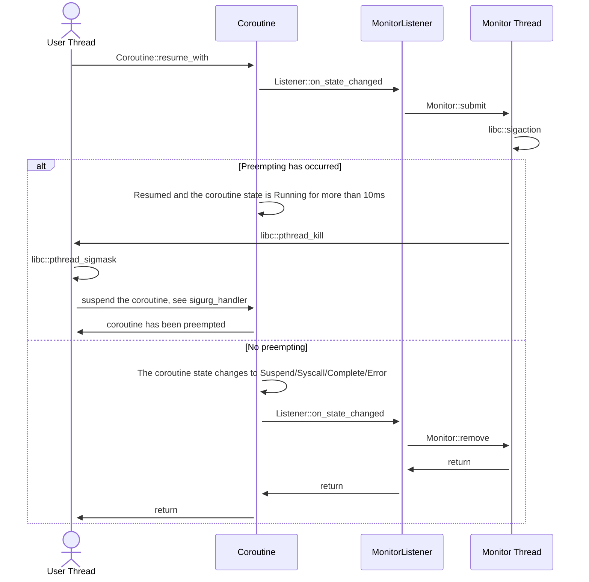

# Monitor Overview

## Supported Targets

The `preemptive` feature currently supports the following targets:

|               | ELF (Linux, BSD, bare metal, etc) | Darwin (macOS, iOS, etc) | Windows |
|---------------|-----------------------------------|--------------------------|---------|
| `x86_64`      | ✅                                | ✅                       | ❌     |
| `x86`         | ✅                                | ❌                       | ❌     |
| `AArch64`     | ✅                                | ✅                       | ❌     |
| `ARM`         | ✅                                | ❌                       | ❌     |
| `RISC-V`      | ✅                                | ❌                       | ❌     |
| `LoongArch64` | ✅                                | ❌                       | ❌     |

✅ Tested and stable; ⚠️ Tested but unstable; ❌ Not supported.

⚠️ If you want to use `preemptive` feature with `open-coroutine-core` not `open-coroutine`, you must learn
[Hook Overview](../../../hook/docs/en/hook.md).

## Usage

```rust
use open_coroutine_core::co;
use open_coroutine_core::common::constants::CoroutineState;
use open_coroutine_core::coroutine::Coroutine;

fn main() -> std::io::Result<()> {
    // Simulate the most extreme dead loop, if the preemptive feature
    // is not enabled, it will remain stuck in a dead loop after resume.
    let mut coroutine: Coroutine<(), (), ()> = co!(|_, ()| { loop {} })?;
    assert_eq!(CoroutineState::Suspend((), 0), coroutine.resume()?);
    // will never reach if the preemptive feature is not enabled
    assert_eq!(CoroutineState::Suspend((), 0), coroutine.state());
    Ok(())
}
```

## Why preempt?

After a `Coroutine::resume_with`, a coroutine may occupy the scheduling thread for a long time, thereby slowing down
other coroutines scheduled by that scheduling thread. To solve this problem, we introduce preemptive scheduling, which
automatically suspends coroutines that are stuck in long-term execution and allows other coroutines to execute.

The coroutine occupies scheduling threads for a long time in two scenarios: getting stuck in heavy computing or syscall.
The following only solves the problem of getting stuck in heavy computing.

## What is monitor?

The `monitor` mod implements the `preemptive` feature for open-coroutine, which allows the coroutine to be preempted
when it is running for a long time.

## How it works


