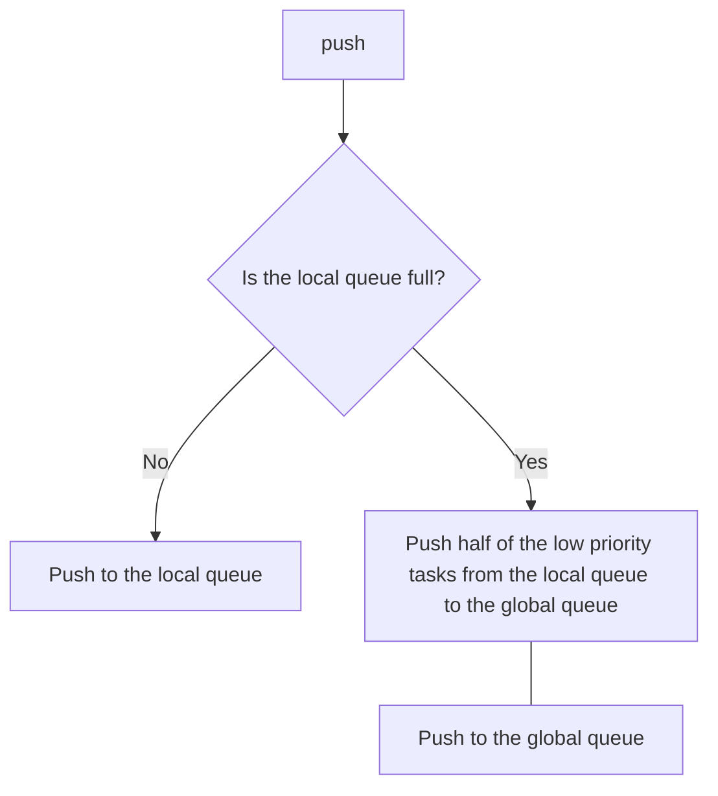
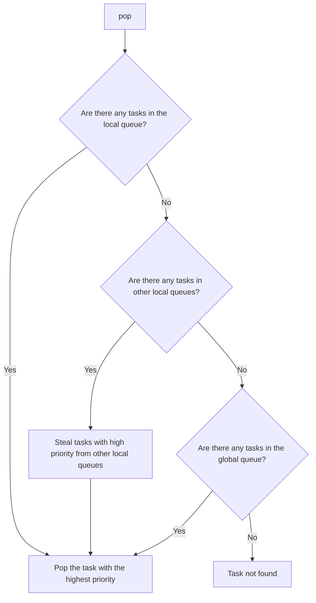

# Ordered Work Steal Overview

## Why ordered work steal?

In the real world, there are always threads that complete their own tasks first, while other threads have tasks to be
processed. Then, a spectacular scene emerged where one core was in difficulty and other cores were watching.

    

Obviously, we don't want this to happen. For idle threads, instead of letting them watch other threads working, it's
better to let them help other threads work. In addition, we hope to pop tasks based on priority, the higher the
priority, the earlier it will be popped up.

## What is ordered work steal queue?

An ordered work steal queue consists of a global queue and multiple local queues, the global queue is unbounded, while
the local queue has a bounded `SkipList` with collections. To ensure high performance, the number of local queues is
usually equal to the number of threads. I's worth mentioning that if all threads prioritize local tasks, there will be
an extreme situation where tasks on the shared queue will never have a chance to be scheduled. To avoid this imbalance,
refer to goroutine, every time a thread has scheduled 60 tasks from the local queue, it will be forced to pop the
`highest priority task` from the shared queue.

## How `push` works

## How `pop` works

