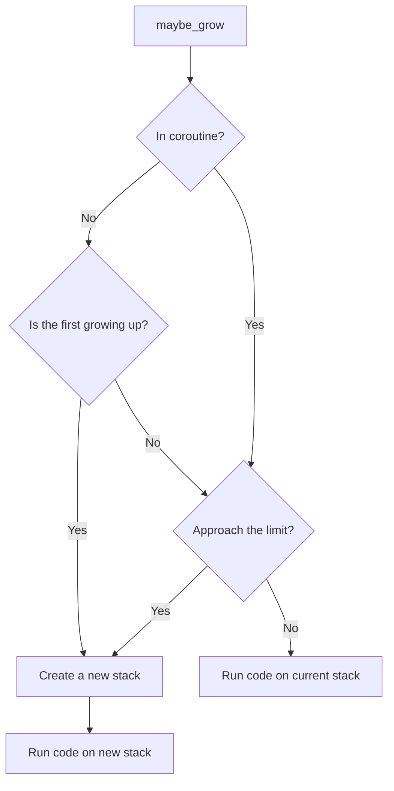

# Scalable Stack Overview

English | [中文](../cn/scalable-stack.md)

## Usage

```rust
use open_coroutine_core::co;
use open_coroutine_core::common::constants::CoroutineState;
use open_coroutine_core::coroutine::suspender::Suspender;
use open_coroutine_core::coroutine::Coroutine;

fn main() -> std::io::Result<()> {
    let mut co = co!(|_: &Suspender<(), i32>, ()| {
        fn recurse(i: u32, p: &mut [u8; 10240]) {
            // You can also use `maybe_grow` in thread.
            Coroutine::<(), i32, ()>::maybe_grow(|| {
                // Ensure the stack allocation isn't optimized away.
                unsafe { std::ptr::read_volatile(&p) };
                if i > 0 {
                    recurse(i - 1, &mut [0; 10240]);
                }
            })
            .expect("allocate stack failed")
        }
        // Use ~500KB of stack.
        recurse(50, &mut [0; 10240]);
    })?;
    assert_eq!(co.resume()?, CoroutineState::Complete(()));
    Ok(())
}
```

## Why scalable stack?

The default stack size of coroutine is 128KB, which is sufficient for most scenarios, but there are still some scenarios
that are not applicable, such as recursive algorithms. The scalable stack enables annotating fixed points in programs
where the stack may want to grow larger. Spills over to the heap if the stack has hit its limit.

## How it works


