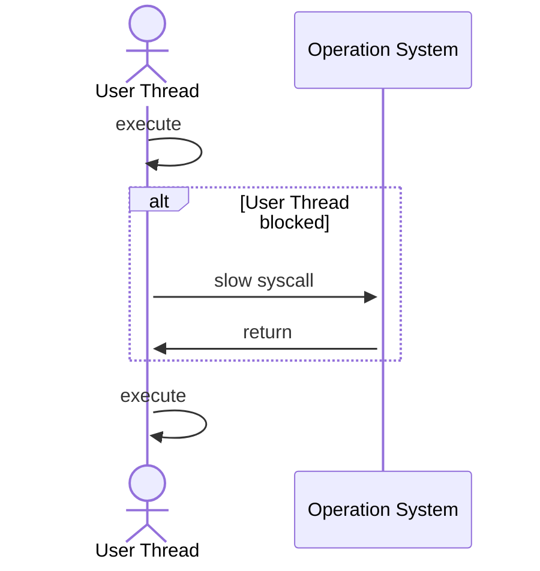
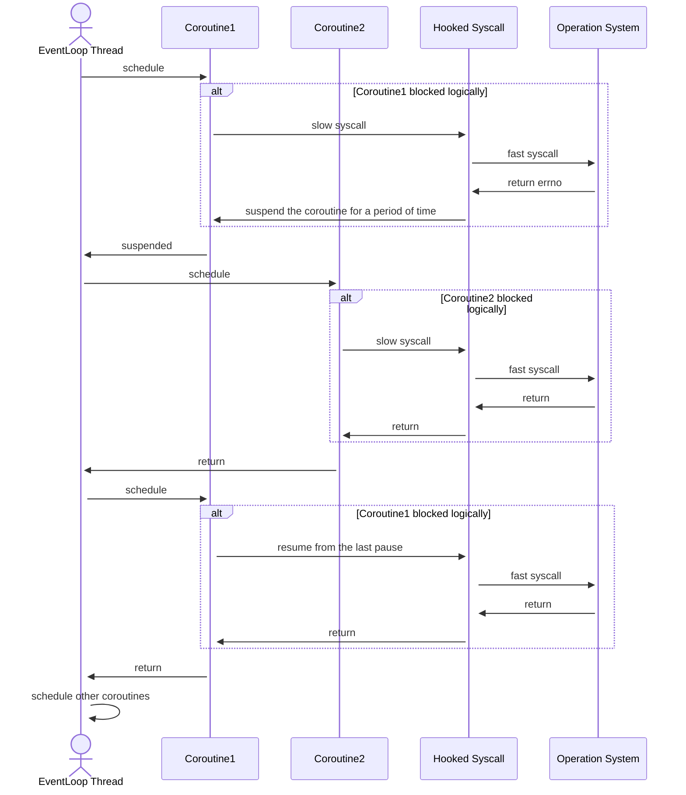
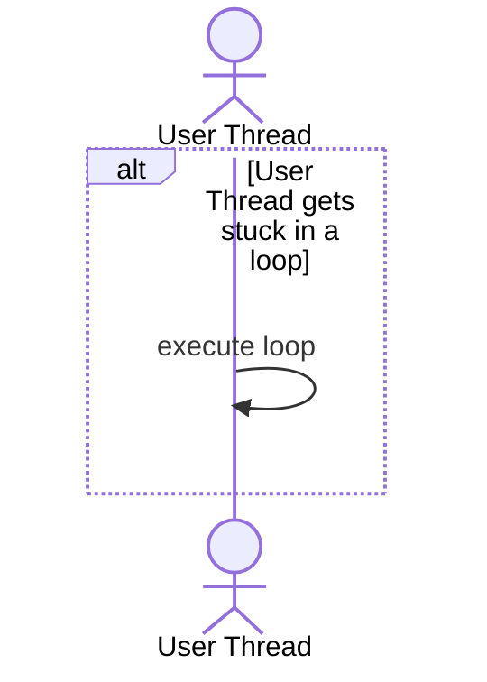
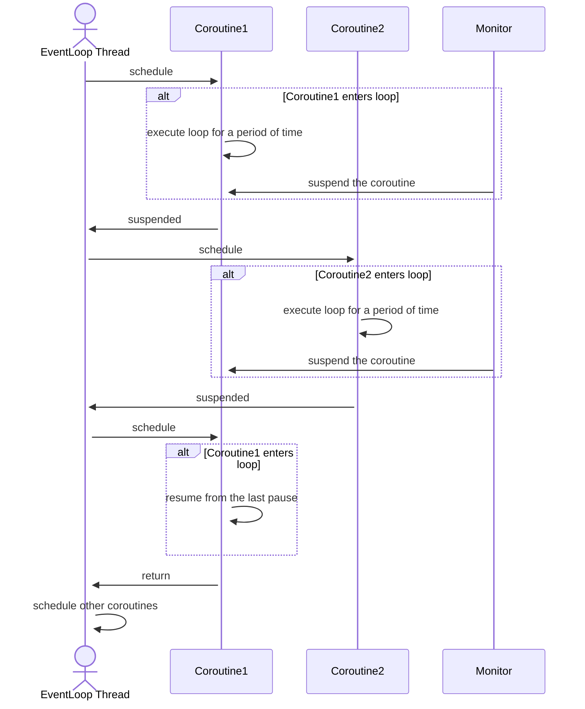

# Why Better

## Syscall will not block

Firstly, let's take a look at how thread collaborate with syscall.

If the syscall is a slow syscall, such as `accept` without setting non-blocking, the thread will be blocked for a long
time and unable to do anything until the OS returns. Now, let's take a look at how open-coroutine collaborate with 
syscall.

As you can see, `Hooked Syscall` converts `slow syscall` to `fast syscall`. In this way, although the `EventLoop Thread`
will still be blocked when executing syscall, the blocking time is very short. Therefore, compared to the thread model,
`EventLoop Thread` can do more things in the same amount of time.

## Heavy computing will not block

Secondly, let's take a look at how threads handle heavy computations.

Just like syscall above, thread will always block in the loop. Then, let's take a look at how open-coroutine handle 
heavy computations.

`Monitor` will monitor the execution of coroutines, and once it found that the execution time of a coroutine is too 
long, it will force the coroutine to suspend. So now, we can even use just one `EventLoop Thread` to execute multiple 
loops, which cannot be achieved under the single threaded model.
