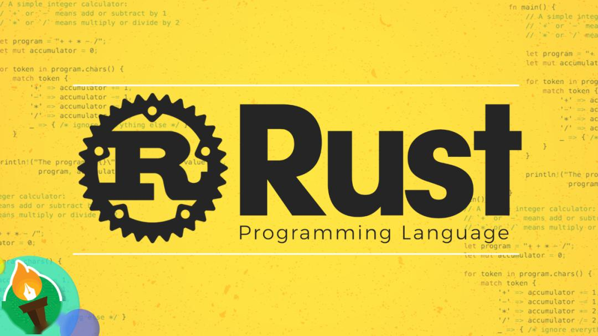
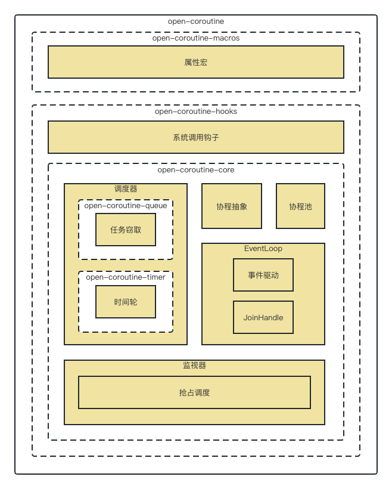
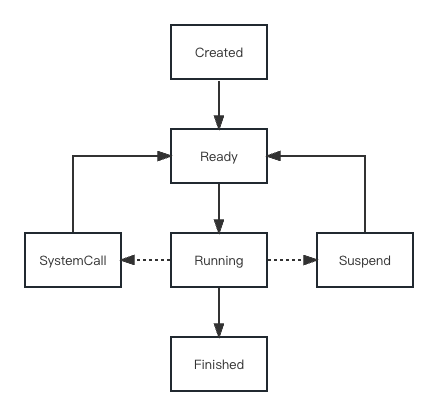
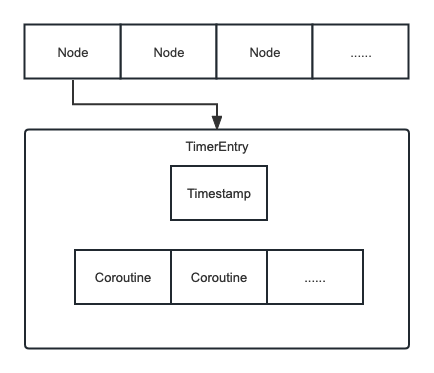
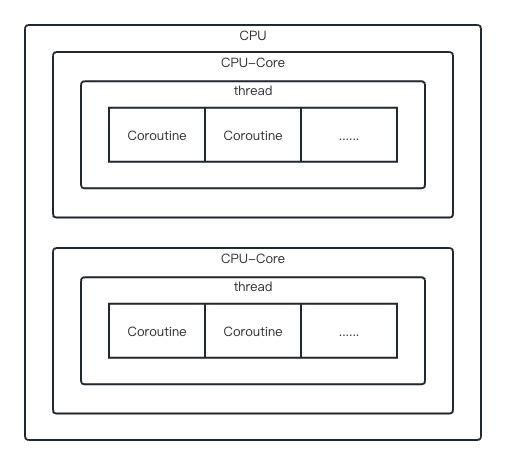
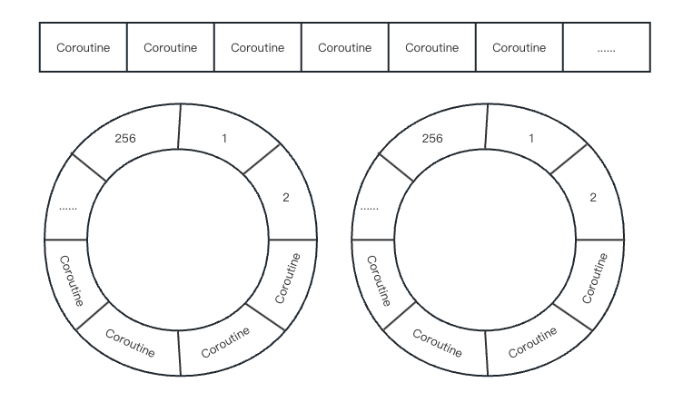
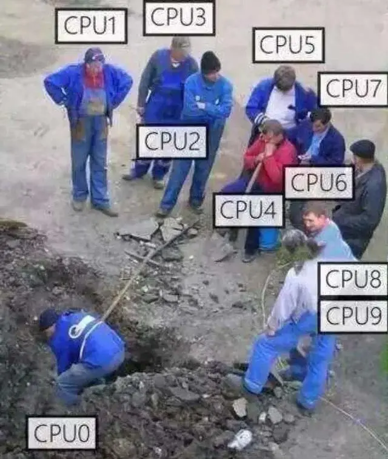
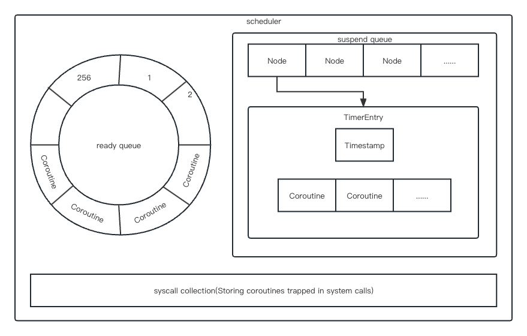
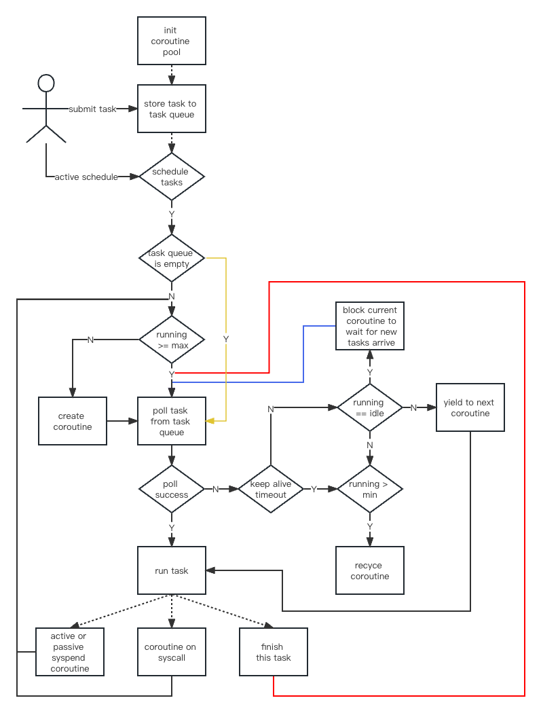
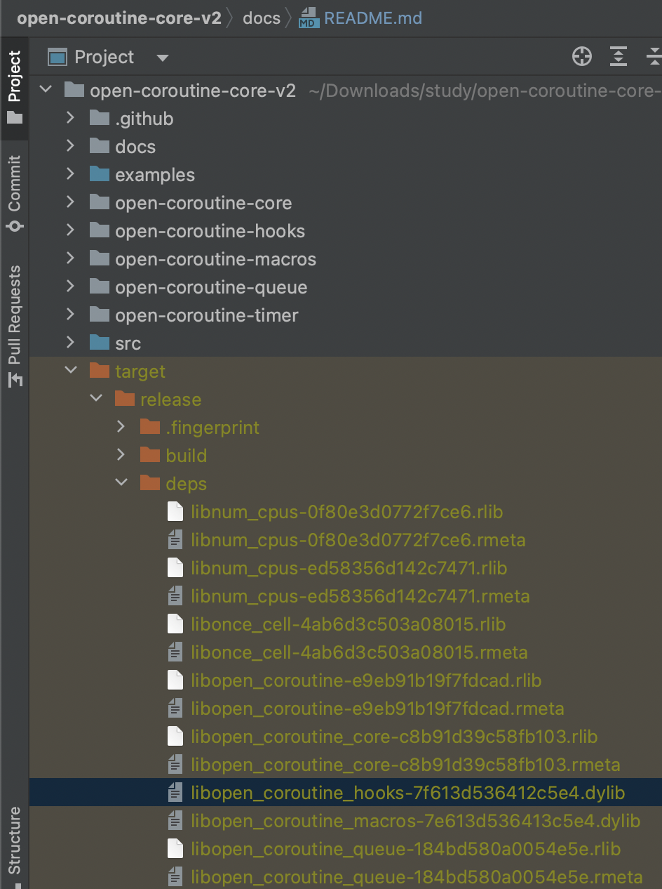

# open-coroutine

## 目录

- [诞生之因](#诞生之因)
- [三顾协程](#三顾协程)
- [语言选择](#语言选择)
- [核心特性](#核心特性)
- [架构设计](#架构设计)
- [底层抽象](#底层抽象)
- [时间轮](#时间轮)
- [协程窃取](#协程窃取)
- [调度器](#调度器)
- [抢占调度](#抢占调度)
- [协程池](#协程池)
- [EventLoop](#EventLoop)
- [Hook](#Hook)

## 诞生之因

在早期程序员为了支持多个用户并发访问服务应用，往往采用多进程方式，即针对每一个TCP网络连接创建一个服务进程。在2000年左右，比较流行使用CGI方式编写Web服务，当时人们用的比较多的Web服务器是基于多进程模式开发的Apache
1.3.x系列，因为进程占用系统资源较多，而线程占用的资源更少，所以人们开始使用多线程方式编写Web服务应用，这使单台服务器支撑的用户并发度提高了，但依然存在资源浪费的问题。

2020年我入职W公司，由于内部系统不时出现线程池打满的情况，再加上TL读过[《Java线程池实现原理及其在美团业务中的实践》](https://tech.meituan.com/2020/04/02/java-pooling-pratice-in-meituan.html)
，我们决定构建自己的动态线程池，从结果来看，效果不错：

<div style="text-align: center;">
    
</div>

但是这没有从根本上解决问题。

众所周知，只要线程数超过CPU核心数就会带来额外的线程上下文切换开销，线程数越多，线程上下文切换开销越大。

对于CPU密集型任务，只需保证线程数等于CPU核心数(以下简称为`thread-per-core`)
，即可保证最优性能，而对于IO密集型任务，由于任务几乎必定阻塞住线程，线程上下文切换开销一般小于阻塞开销，但当线程数过大时，线程上下文切换开销就会大于阻塞开销了。

动态线程池的本质就是通过调整线程数，尽可能地让线程上下文切换开销小于阻塞开销。由于这个是人工保证的，那么必然保证不了。

<div style="text-align: center;">
    
</div>

那么有没有一种技术能够在保证thread-per-core的前提下，执行IO密集型任务性能不输多线程呢？

答案是`NIO`，但仍存在一些限制或者不友好的地方：

1. NIO API使用起来较为复杂；
2. Thread.sleep()等阻塞调用会阻塞线程，相当于禁用所有阻塞调用，这对开发者不友好；
3. 在线程模型下，只有当前任务执行完了，才能执行下一个任务，无法实现任务间的公平调度；

PS：假设单线程，CPU时间片为1s，有100个任务，公平调度指每个任务都能公平地占用到10ms的时间片。

1还可以克服，2和3是硬伤，其实如果能够实现3，RPC框架们也不用搞太多线程，只要thread-per-core即可。

如何在能够保证thread-per-core、执行IO密集型任务性能不输多线程的前提下，使用还十分简单呢？

`协程`慢慢进入了我的视野。

## 三顾协程

一开始玩协程，出于学习成本的考虑，首先选择的是`kotlin`，但当我发现kotlin的协程需要更换API(
比如把Thread.sleep替换为kotlinx.coroutines.delay)才不会阻塞线程后，果断把方向调整为`golang`，大概2周后：

<div style="text-align: center;">
    
</div>

协程技术哪家强，编程语言找golang。

然而随着更深入的学习，我发现几个`goroutine`的不足：

1. `不是严格的thread-per-core`。goroutine运行时也是由线程池来支撑的，而这个线程池的最大线程为256，这个数字可比thread-per-core的线程数大得多；
2. `抢占调度会打断正在运行的系统调用`。如果这个系统调用需要很长时间才能完成，显然会被打断多次，整体性能反而降低；
3. `goroutine离极限性能有明显差距`。对比隔壁c/c++协程库，其性能甚至能到goroutine的1.5倍；

带着遗憾，我开始继续研究c/c++的协程库，发现它们要么是只做了`hook`(后面再详细解释)，要么只做了`任务窃取`
，还有一些库只提供最基础的`协程抽象`，而最令人失望的是：没有一个协程库实现了`抢占调度`。

没办法，看样子只能自己干了。

<div style="text-align: center;">
    
</div>

## 语言选择

既然决定造轮子，那么需要选择开发轮子的语言。

之前研究c协程库时，有看到大佬已经尝试过用c写动态链接库、然后java通过jni去调这种方式，最终失败了，具体原因得深入JVM源码才能得知，对鄙人来说太高深，告辞，因此排除java/kotlin等JVM字节码语言。

显然，用golang再去实现一个goroutine，且不说其复杂程度完全不亚于深入JVM源码，而且即使真的做出来，也不可能有人愿意在生产环境使用，因此排除golang。

到目前为止还剩下c/c++/rust 3位选手。

从研究过的好几个用c写的协程库来看，c的表达力差了点，需要编写巨量代码。相较之下，c++表达力就强多了，但开发的效率还是低了些，主要体现在以下几个方面：

1. `需要不停地写cmake`，告诉系统怎么编译它，有些麻烦；
2. `依赖管理麻烦`。如果要用别人写的类库，把代码拉下来，放到自己项目里，然后需要耗费大量时间来通过编译。如果别人依赖的库没有其他依赖还好，一旦有其他依赖，那么它依赖的依赖，也得按照刚才说的步骤处理，这就十分麻烦了；
3. `内存安全`。c++很难写出没有内存泄漏/崩溃的代码。

<div style="text-align: center;">
    
    
</div>

## 核心特性

经过长时间的研究及实践，我认为一个完美的协程库应当同时具备以下5个特性：

1. `挂起/恢复`。协程可以在执行过程中挂起(即保存自己的上下文状态)，等某个异步操作返回结果后再恢复(即恢复自己的上下文状态)
   执行。挂起与恢复是协程最核心的点，它们的高效实现是协程能够实现异步操作和提高并发性能的关键所在；
2. `hook`。如果没有hook系统调用，并且未引入`抢占调度`机制，那么最终产出的协程库必定出现诸多限制，比如禁止使用sleep、禁止用阻塞socket读写数据等等；
3. `无栈协程`。线程在访问协程栈的数据时，由于线程栈所在的内存区域和协程栈所在的内存区域大概率不是连续的，所以很容易出现cache
   miss，而无栈协程由于直接使用线程栈，cache local显然更好；
4. `任务窃取`。在实际运行时，若不支持任务窃取，可能出现一核有难、多核围观的情况。支持任务窃取后，当前线程如果被某个协程阻塞住了，其他线程会把这个线程本地队列中的其他协程拿过来执行；
5. `抢占调度`。如果协程在运行过程中出现了死循环，可能导致所有调度协程的线程陷入死循环，最终可能导致服务不可用。引入抢占调度后，会自动挂起陷入死循环的协程，让其他协程执行。

<div style="text-align: center;">
    
</div>

PS：这里解释下hook技术，简单的说，就是函数调用的代理，比如调用sleep，没有hook的话会调用操作系统的sleep函数，hook之后会指向我们自己的代码，详细操作步骤可参考`《Linux/Unix系统编程手册》41章和42章`。

## 架构设计

<div style="text-align: center;">
    
</div>

## 底层抽象

| 类库   | [context-rs](https://github.com/zonyitoo/context-rs)                                                                      | [corosensei](https://github.com/Amanieu/corosensei)                                | [genawaiter](https://github.com/whatisaphone/genawaiter)                  |
|------|---------------------------------------------------------------------------------------------------------------------------|------------------------------------------------------------------------------------|---------------------------------------------------------------------------|
| 类型   | 有栈协程                                                                                                                      | 有栈协程                                                                               | 无栈协程                                                                      |
| 完善程度 | 一般                                                                                                                        | 高                                                                                  | 高                                                                         |
| 优点   | 几乎支持所有操作系统及CPU架构，且可定制化程度高                                                                                                 | 提供了高性能&安全的抽象，汇编指令经过了深度优化，且支持[backtrace](https://github.com/rust-lang/backtrace-rs) | 目前最好的rust无栈协程基础库，支持[backtrace](https://github.com/rust-lang/backtrace-rs) |
| 缺点   | 不支持[backtrace](https://github.com/rust-lang/backtrace-rs)，且做支持的难度大；二开过程中容易踩坑，而且极难排查                                       | 不好做深度定制，后续无论是做减少协程切换次数的优化，还是做其他优化，难度都较大；受限于rust内联汇编的实现，只对主流系统及CPU架构做了支持            | 底层使用rust协程实现，无论是抢占调度还是hook都无法做到彻底                                         |
| 备注   | 其中[context](https://github.com/boostorg/context)的代码未更新，如果要写最好自己参考[context-rs](https://github.com/zonyitoo/context-rs)重新封装 | [作者](https://github.com/Amanieu)是rust语言社区的大佬                                       | rust async关键字的传染性是硬伤                                                      |

附上[协程切换方式性能对比](https://tboox.org/cn/2016/10/28/coroutine-context)
，如果是有栈协程，性能最好的底层是基于[context](https://github.com/boostorg/context)
做改造，直接抛弃对浮点数的支持，在x86_64下的linux，性能预计提升`125%~300%`。

暂时采用[corosensei](https://github.com/Amanieu/corosensei)，目前正在尝试自研无栈协程。

`suspend`和`resume`原语直接复用[corosensei](https://github.com/Amanieu/corosensei)，这里不过多赘述。
选好底层库，接着就是确定协程的状态了，下面是个人理解：

<div style="text-align: center;">
    
</div>

## 时间轮

时间轮的数据结构如下图所示，本质上就是一个时间戳对应多个需要唤醒的协程。

这里采用动态数组，在open-coroutine中使用都是末尾插入，因此写入速度尚可，遍历时可充分利用CPU cache。

<div style="text-align: center;">
    
</div>

## 协程窃取

一个CPU核心可以运行多个线程，一个线程可以调度多个协程，但为了减少线程间的竞争，线程只调度它本地集合里的协程。同时，为了最大程度地减少线程上下文切换开销，我们采用thread-per-core模型。

<div style="text-align: center;">
    
</div>

现在，仍有一些细节需要确定，集合用什么数据结构？集合是有界还是无界？

RingBuffer作为最常用的高性能数据结构，主要有几个优点：

1. 相比链表等其他数据结构，RingBuffer具有更好的CPU缓存友好性；

2. 由于是固定大小，能够避免频繁的内存分配和释放带来的开销；

3. 无锁化设计，使用CAS代替锁，性能更高；

由于RingBuffer有界，如果创建的协程过多，本地RingBuffer必定被打满，剩下的协程该何去何从？直接丢弃肯定是不行的，这里我们参考goroutine，搞个无界共享队列。还有另一种相反的情况，本地RingBuffer可能持续一段时间无协程可调度，咋办？从无界共享队列取呗。

即便如此，仍然存在后续问题，如果所有线程都优先考虑本地RingBuffer，则会出现一种极端情况：共享队列上的协程永远没有被调度起来的机会。为了避免这种不均衡的情况出现，还是参考goroutine，让每个线程在调度了61个本地RingBuffer的协程后，就去共享队列中看一看。

至此，集合的数据结构已经确定。

<div style="text-align: center;">
    
</div>

在现实世界中，总有线程会先把自己需要调度的协程处理完，而其他线程还有协程待处理。于是乎，一核有难、多核围观的壮观景象就出现了。

<div style="text-align: center;">
    
</div>

显然我们不希望这样，因此，对于空闲的线程，与其让它围观其他正在干活的线程，不如让它下场帮其他线程干活。自然而然地，新的问题来了，如何高效地帮其他线程干活？

无非两种方案，一是先从共享队列取协程，再从其他本地RingBuffer取协程；二是先从其他本地RingBuffer取协程，再从共享队列取协程。怎么选？竞争共享队列等价于竞争一把共享写锁，再竞争其他本地RingBuffer等价于竞争多把共享写锁，从并发冲突的角度考虑，自然是资源越多越好，因此选择方案二。

其他实现细节可参考[《Tokio解析之任务调度》](https://baijiahao.baidu.com/s?id=1746023143258422548)
，虽然实际用的是[st3](https://github.com/asynchronics/st3)，但原理相通。

## 调度器

还记得[底层抽象](#底层抽象)里提到的协程状态吗？

我们用[时间轮](#时间轮)来实现suspend队列，基于[协程窃取](#协程窃取)实现ready队列(至于syscall集合，先卖个关子)
，剩下只要实现submit(往ready队列添加协程)和try_schedule(非阻塞地调度协程)两个方法，就完成了一个功能强大的调度器。

<div style="text-align: center;">
    
</div>

submit方法的实现非常简单，就不阐述了。我们直接谈try_schedule，其实也简单，就是真正调度前，检查一下suspend队列是否有需要运行的协程，如果有则把它加到ready队列，然后调度ready队列的协程就行了(
任务窃取算法在[底层](#协程窃取)已经实现了)。

另外，从扩展性的角度考虑，作者添加了Listener API，当协程创建/挂起/陷入系统调用/完成时，均会回调用户函数，典型适用场景如打日志、监控等等。

## 抢占调度

抢占调度可以让一个正在执行的协程被中断，以便其他等待执行的协程有机会被调度并运行。这种机制可以在遇到阻塞操作或计算密集型任务时及时切换执行其他协程，避免因为一个协程的长时间执行而导致整个程序的性能下降。

在go语言中，抢占调度是通过采用协作式和抢占式混合调度实现的。当协程主动发起I/O操作、调用runtime.Gosched()
函数或访问channel等等时，会发生协作式调度，即主动让出CPU并让其他协程执行。而当一个协程超过一定时间限制或发生系统调用等情况时，会发生抢占式调度，即强制剥夺当前协程的执行权。这样的混合调度机制可以在保证程序的高并发性的同时，增加系统的响应能力。

为了提高程序的并发性和响应能力，open-coroutine也引入了基于信号的抢占调度机制。与goroutine略微有些差异的是，当发生系统调用时，部分系统调用也会发生协作式调度(
先卖个关子，后续再详细介绍)。

我们把以下代码当成协程体：

```c++
{
    // 模拟死循环协程体
    while (count < 1) {
       std::cout << "Waiting for signal..." << std::endl;
       sleep(1);
    }
}
```

如何抢占它呢？下给是一个简单的c++信号抢占例子：

```c++
#include <iostream>
#include <csignal>
#include <unistd.h>
#include <thread>

static int count = 0;

void signal_handler(int signum) {
    // 此时已经t1已经被抢占了
    std::cout << "Received signal " << signum << std::endl;
    count++;
}

void thread_main() {
    // 注册信号处理函数
    struct sigaction sa;
    sa.sa_handler = signal_handler;
    sigemptyset(&sa.sa_mask);
    sa.sa_flags = SA_RESTART;
    if (sigaction(SIGINT, &sa, NULL) == -1) {
        std::cerr << "Failed to register handler for SIGINT" << std::endl;
        return;
    }

    // 模拟死循环协程体
    while (count < 1) {
        std::cout << "Waiting for signal..." << std::endl;
        sleep(1);
    }
    std::cout << "thread main finished!" << std::endl;
}

int main() {
    std::thread t1(thread_main);
    sleep(1);
    pthread_kill(t1.native_handle(), SIGINT);
    t1.join();
    return 0;
}
```

控制台输出结果：

```text
Waiting for signal...
Received signal 2
thread main finished!
```

解释下，在主线程中，我们开启了一个子线程t1，在注册信号处理函数后，子线程t1将会陷入死循环并输出`Waiting for signal...`
到控制台。主线程在睡眠1s后，向子线程t1发送信号，子线程t1的执行权被移交给信号处理函数signal_handler，信号处理函数结束后，子线程t1的执行权回到之前执行的地方(
也就是`std::cout << "Waiting for signal..." << std::endl;`下面一行代码)
继续执行，此时条件不满足，子线程t1跳出循环，打印`thread main finished!`，子线程t1执行完毕，随后主线程结束等待，也执行完毕。

接下来，我们考虑更复杂的情况，即需要重复抢占，修改代码如下：

```c++
void signal_handler(int signum) {
    // 此时已经t1已经被抢占了
    std::cout << "Received signal " << signum << std::endl;
    count++;
    // 模拟死循环协程体，需要再次被抢占
    while (count < 2) {
        std::cout << "signal handler Waiting for signal..." << std::endl;
        sleep(1);
    }
}
```

子线程t1只要能进入signal_handler函数2次，就等于天然支持重复抢占。

再次运行，观察控制台的输出：

```text
Waiting for signal...
Received signal 2
signal handler Waiting for signal...
signal handler Waiting for signal...
```

我们发现子线程t1被永远卡在信号处理函数signal_handler里了，这是怎么回事？

子线程t1在进入信号处理函数signal_handler前，linux系统会对线程本地的信号掩码做处理，屏蔽将要处理的信号，以确保程序的正常运行和数据的完整性。否则，当一个程序正在处理一个关键性任务时，如果接收到某个中断信号或者其他干扰信号，可能会导致程序的异常终止或者数据的不完整。

由于我们确实需要重复抢占来保证程序的正常运行，因此需要解除信号屏蔽，当然，还需要再次发送信号。下面直接给出全量代码：

```c++
#include <iostream>
#include <csignal>
#include <unistd.h>
#include <thread>

static int count = 0;

void signal_handler(int signum) {
    std::cout << "Received signal " << signum << std::endl;
    count++;
    // 解除信号屏蔽
    sigset_t mask;
    pthread_sigmask(SIG_BLOCK, NULL, &mask);
    sigdelset(&mask, SIGINT);
    pthread_sigmask(SIG_SETMASK, &mask, NULL);
    // 模拟死循环协程体，需要再次被抢占
    while (count < 2) {
        std::cout << "signal handler Waiting for signal..." << std::endl;
        sleep(1);
    }
}

void thread_main() {
    // 注册信号处理函数
    struct sigaction sa;
    sa.sa_handler = signal_handler;
    sigemptyset(&sa.sa_mask);
    sa.sa_flags = SA_RESTART;
    if (sigaction(SIGINT, &sa, NULL) == -1) {
        std::cerr << "Failed to register handler for SIGINT" << std::endl;
        return;
    }

    // 模拟死循环协程体
    while (count < 1) {
        std::cout << "Waiting for signal..." << std::endl;
        sleep(1);
    }
    std::cout << "thread main finished!" << std::endl;
}

int main() {
    std::thread t1(thread_main);
    sleep(1);
    pthread_kill(t1.native_handle(), SIGINT);
    sleep(1);
    pthread_kill(t1.native_handle(), SIGINT);
    t1.join();
    return 0;
}
```

大家关注signal_handler和main的改动即可，第三次运行，观察控制台的输出：

```c++
Waiting for signal...
Received signal 2
signal handler Waiting for signal...
signal handler Waiting for signal...
Received signal 2
Waiting for signal...
thread main finished!
```

上述涉及的系统调用sigemptyset、sigaction、pthread_kill、pthread_sigmask和sigdelset，建议阅读《Linux/UNIX系统编程手册》20~
22章节的内容以加深理解。

## 协程池

虽然协程比线程耗费的资源更少，但频繁创建和销毁协程仍然会消耗大量的系统资源，因此将协程池化是必须的。池化后，能带来几个显著优势：

1. 资源管理：协程池可以管理协程的创建、销毁和复用。通过使用协程池，可以事先创建好一定数量的协程，并将它们存储在池中供需要时使用。这样可以避免频繁的创建和销毁协程，提高系统的资源利用率。

2. 避免协程饥饿：在使用协程池时，协程会被持续提供任务，避免了协程执行完任务后处于空闲状态的情况。

3. 控制并发度：协程池可以限制并发协程的数量，避免系统因为协程过多而过载。通过设置协程池的大小，可以控制并发度，保证系统资源的合理分配。

4. 提高代码的可维护性：使用协程池可以将任务的执行和协程的管理分离开来，使代码更加清晰和可维护。任务的执行逻辑可以集中在任务本身，而协程的创建和管理则由协程池来负责。

在open-coroutine中，协程池是惰性的，如果用户不主动调度，任务将不会执行，具体请看下方的流程图：

<div style="text-align: center;">
    
</div>

## EventLoop

传统多进程或多线程编程方式均采用了阻塞编程，这会使得服务端的进程或线程因等待客户端的请求数据而变得空闲，而且在该空闲期间还不能做别的事情，白白浪费了操作系统的调度时间和内存资源。这种一对一的服务方式在广域网的环境下显示变得不够廉价，于是人们开始采用非阻塞网络编程方式来提升网络服务并发度。

event loop核心采用非阻塞IO和事件队列技术，是一种常见的异步编程模型，可以高效地处理多个并发任务。虽然自身为单线程模型，但可轻易通过多线程扩展来提升程序性能。

跨平台方面，目前open-coroutine仅从[mio](https://github.com/tokio-rs/mio)
移植了epoll和kevent，意味着在windows下无法使用；具体操作层面，提供对读写事件的添加/删除/修改/监听(比如epoll_wait)
操作。结合[协程池](#协程池)，我们可以轻易地往event
loop中添加非IO任务，然后在监听操作前主动调度这些任务，当然，最后触发监听操作的时间需要减去调度耗时；性能方面，直接内置thread-per-core线程池，并对任务队列前做负载均衡(
由于[协程池](#协程池)和[协程窃取](#协程窃取)的存在，即使不做负载均衡也没问题)。

## Hook

Hook是一种机制，通过在运行时插入自定义代码，可以修改或扩展现有代码的行为，甚至能对系统调用进行监控、拦截、修改、重定向。

接下来举例实操：

```c++
#include <unistd.h>

int main() {
    sleep(60);
    return 0;
}
```

以上就是要被hook的代码，不出意外，直接运行它将耗费你宝贵的60秒。后续我们将在不改动它的前提下，完成对sleep()的重写。

下面是改动前的CMakeLists.txt：

```cmake
cmake_minimum_required(VERSION 3.25)
project(main)

set(CMAKE_CXX_STANDARD 11)

add_executable(main main.cpp)
```

下面是我们重写的sleep实现：

```c++
#include <iostream>
#include <unistd.h>

unsigned int sleep(unsigned int s) {
    std::cout << "simulate sleep for " << s << "s" << std::endl;
    return 0;
}
```

下面是改动后的CMakeLists.txt：

```cmake
cmake_minimum_required(VERSION 3.25)
project(main)

set(CMAKE_CXX_STANDARD 11)

add_library(libhook SHARED hook.cpp)
add_executable(main main.cpp)
target_link_libraries(main libhook)
```

重新编译运行，我们发现main函数很快就结束了，并且能在console上看到`simulate sleep for 60s`的输出。

以上是在c++中玩hook，如何在rust中玩hook呢？

在rust中，crate默认会被编译成rlib文件，想玩hook，首先我们得确保编译出的产物是c语言能够识别的动态链接库，在Cargo.toml中指定crate-type为cdylib即可：

```toml
[package]
name = "open-coroutine-hooks"
# 省略不重要的信息
[lib]
crate-type = ["cdylib"]
```

下一步是链接它，我们需要编写build.rs：

```rust
fn main() {
    //link hook dylib
    println!("cargo:rustc-link-lib=dylib=open_coroutine_hooks");
}
```

原本以为到这里就可以了，然而当作者满心欢喜把crate发布到https://crates.io ，再拉下来测试，意想不到的坑出现了：无法正确链接！

怎么回事？

<div style="text-align: center;">
    
</div>

(如果你在构建时没有加--release，可以到/target/debug/deps中看看)

rust为了解决某些问题(如果有知道的同学请指教)，对每个构建产物名都会加上一串字符，导致文件名变成了`libopen_coroutine_hooks-7f613d536412c5e4.dylib`，而能够正确链接的文件名是`libopen_coroutine_hooks.dylib`(动态链接库的文件名在macos上以`.dylib`结尾，在linux上是以`.so`结尾，在windows上则是以`.dll`结尾，上面的截图来自于作者的macbook pro)。

知道原因后，解决它不难，作者选择的办法是重命名，附上修复后的build.rs代码：

```rust
use std::env;
use std::path::PathBuf;

fn main() {
    //fix dylib name
    let out_dir = PathBuf::from(env::var("OUT_DIR").unwrap());
    let deps = out_dir
        .parent()
        .unwrap()
        .parent()
        .unwrap()
        .parent()
        .unwrap()
        .join("deps");
    let mut pattern = deps.to_str().unwrap().to_owned();
    if cfg!(target_os = "linux") {
        pattern += "/libopen_coroutine_hooks*.so";
        for path in glob::glob(&pattern)
            .expect("Failed to read glob pattern")
            .flatten()
        {
            std::fs::rename(path, deps.join("libopen_coroutine_hooks.so"))
                .expect("rename to libopen_coroutine_hooks.so failed!");
        }
    } else if cfg!(target_os = "macos") {
        pattern += "/libopen_coroutine_hooks*.dylib";
        for path in glob::glob(&pattern)
            .expect("Failed to read glob pattern")
            .flatten()
        {
            std::fs::rename(path, deps.join("libopen_coroutine_hooks.dylib"))
                .expect("rename to libopen_coroutine_hooks.dylib failed!");
        }
    } else {
        panic!("unsupported platform");
    }
    //link hook dylib
    println!("cargo:rustc-link-lib=dylib=open_coroutine_hooks");
}
```

上面只兼容了macos和linux，至于其他平台，欢迎给本仓库提交PR。
