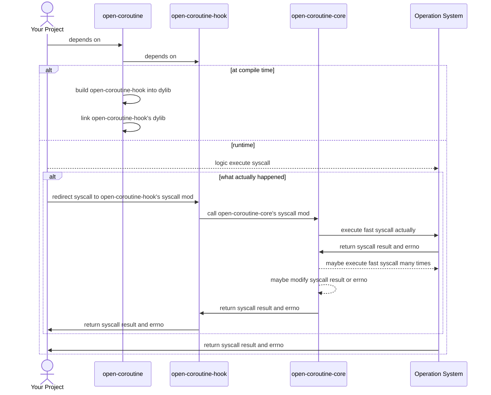

# Hook总览

[English](../en/hook.md) | 中文

## 为什么hook?

在`Coroutine::resume_with`之后，一个协程可能会长时间占用调度线程(例如，陷入重度计算或系统调用)，从而拖慢被该线程调度的其他协程。为了解决陷入系统调用的问题，我们引入hook机制，这样当协程进入系统调用时，它会被自动挂起，从而让其他协程执行。

这带来了一个新问题，`preemptive`特性会`发送大量信号`，而`信号会中断正在执行的系统调用`。此外，由于大多数用户在代码中未处理信号，因此如果他们直接使用`open-routine-core`并且启用`preemptive`特性将导致`灾难性后果`。

## 什么是hook?

Hook可以通过在运行时插入自定义代码来修改或扩展现有代码的行为，甚至可以监控、拦截、修改和重定向系统调用。现在，让我们用一个[例子](https://github.com/loongs-zhang/link-example)来直观地体验它。

假设我们有以下测试代码：

```rust
use std::time::{Duration, Instant};

#[test]
fn test_hook() {
    let start = Instant::now();
    std::thread::sleep(Duration::MAX);
    let cost = Instant::now().duration_since(start);
    println!("cost: {:?}", cost);
}
```

如果我们不hook，因为`std::thread::sleep(Duration::MAX)`，这个测试几乎永远不会结束，但有了hook，我们可以在`不更改测试代码`的情况下将`nanosleep`系统调用重定向到[我们的自定义代码](https://github.com/loongs-zhang/link-example/blob/master/dep/src/lib.rs)，然后测试就会[很快结束](https://github.com/loongs-zhang/link-example/actions/runs/12862762378/job/35858206179)。

<div style="text-align: center;">
    
</div>

## 工作原理


