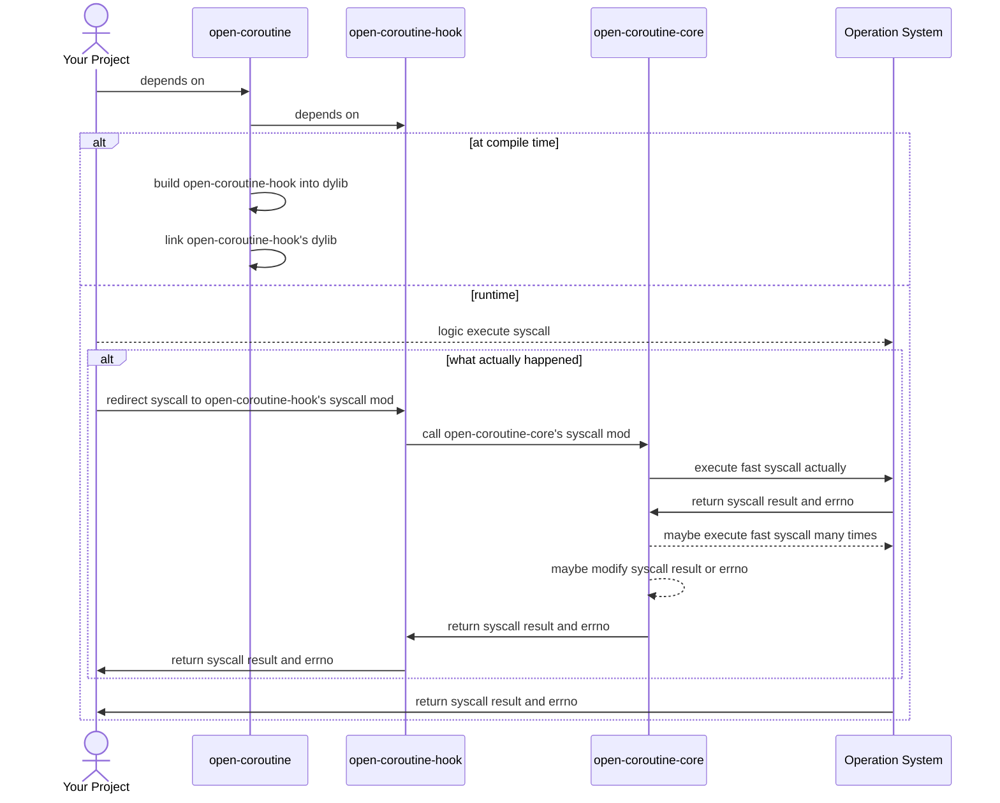

# Hook Overview

English | [中文](../cn/hook.md)

## Why hook?

After a `Coroutine::resume_with`, a coroutine may occupy the scheduling thread for a long time (e.g. getting stuck in
heavy computing or syscall), thereby slowing down other coroutines scheduled by that scheduling thread. To solve the
problem of getting stuck in syscall, we introduce hook, which automatically suspends coroutines that enter syscall and
allow other coroutines to execute.

This brings a new problem, the `preemptive` feature will send a large number of signals `which can interrupt the running
syscall`. In addition, most user code does not handle signals, if they directly use `open-routine-core` and enabling the
preemptive feature will lead to `catastrophic consequences`.

## What is hook?

Hook can modify or extend the behavior of existing code by inserting custom code at runtime, and even monitor,
intercept, modify, and redirect system calls. Now, let's use an [example](https://github.com/loongs-zhang/link-example)
to visually experience it.

Assuming we have the following test code:

```rust
use std::time::{Duration, Instant};

#[test]
fn test_hook() {
    let start = Instant::now();
    std::thread::sleep(Duration::MAX);
    let cost = Instant::now().duration_since(start);
    println!("cost: {:?}", cost);
}
```

If we don't hook, because `std::thread::sleep(Duration::MAX)`, this test almost never ends, but with hook, we redirect
the `nanosleep` syscall
to [our custom code](https://github.com/loongs-zhang/link-example/blob/master/dep/src/lib.rs) `without change the test
code`, and then the test
will [end soon](https://github.com/loongs-zhang/link-example/actions/runs/12862762378/job/35858206179).

<div style="text-align: center;">
    
</div>

## How it works


